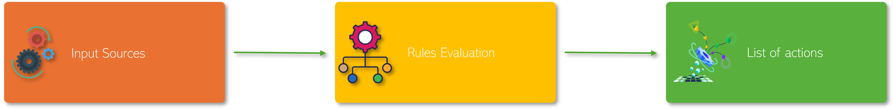
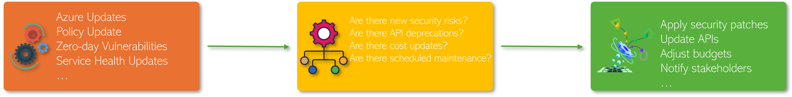
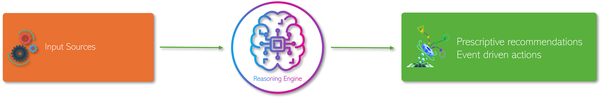
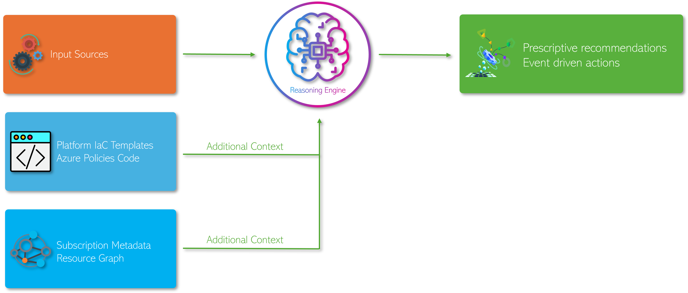

# Platform Life Cycle Management(LCM) AI

The velocity at which hyperscalers providers like Azure, AWS, and Google Cloud introduce new services, features, and deprecate existing ones at an unprecedented pace. This velocity often surpasses the capacity of platform engineering teams to effectively manage and integrate these changes, posing significant challenges in cloud platform lifecycle management.

## The Commonplace Approach: A Recipe for Inefficiency
The conventional method of managing cloud platform lifecycles typically involves three steps:

1. **Identify Changes**: Monitor various sources to detect updates, deprecations, security advisories, and other modifications.

1. **Assess**: Evaluate the relevance and impact of these changes on the platform by applying a set of *guidelines* or *rules*. For instance, they might ask, "*Is TLS 1.1 deprecated?"*[1],[2] or "*Are there new security vulnerabilities?*"

1. **Implement**: Apply insights to the platform environment, often resulting in notifications to teams responsible.

To automate this effectively, we should translate the *guidelines* or *rules* into hard coded logic framework that matches curated data sources using string manipulation. While straightforward, this approach presents several significant limitations:  

- **Limited Adaptability**: Static rules quickly become obsolete due to rapid technological advancements and fail to capture complex platform interdependencies. Success hinges on the team's deep technical knowledge. Without it, critical updates risk being missed or misunderstood. 
- **Lack of Actionable Specificity**: The process relies on broad guidance without clear, actionable steps, placing a heavy burden on individual expertise and leading to inconsistent execution.  
- **Reactive Approach**: Teams often address issues only after they occur, increasing the likelihood of service disruptions rather than proactively mitigating risks.  

## Platform LCM AI

To perform lifecycle management (LCM) that evolves and adapts, transform static rule-based logic into an adaptive reasoning engine. The advancements in AI, particularly large language models (LLMs), to summarize and identify relationships in text allows us to combine our _Sources_ and _Rules_ to effectively create a _reasoning engine_. Now teams can update the behaviour of the _reasoning engine_ using natural language instead of code. This allows teams to update rules dynamically with reduced cognitive overhead.

Incorporating environmental or workload metadata into these systems facilitates the transition from generic guidance to actionable, prescriptive recommendations tailored to specific workloads. This targeted approach empowers teams to execute tasks consistently and proactively, minimizing reliance on individual expertise and reducing the risk of service disruptions.

Embracing AI-driven solutions in platform LCM not only enhances operational efficiency but also positions organizations to better navigate the complexities of modern cloud environments. By leveraging the advanced reasoning capabilities of LLMs, businesses can achieve a more resilient and responsive infrastructure, ensuring sustained success in an ever-changing digital landscape.

### 📚 References

1. [Azure TLS Deprecation][1]
1. [AWS TLS Deprecation][2]
1. [Overlooked Challenge of Efficiently Decommissioning Resources][3]

[1]: https://learn.microsoft.com/en-us/lifecycle/announcements/tls-support-ending-10-31-2024
[2]: https://aws.amazon.com/blogs/security/tls-1-2-required-for-aws-endpoints/
[3]: https://blog.omnistrate.com/posts/49

